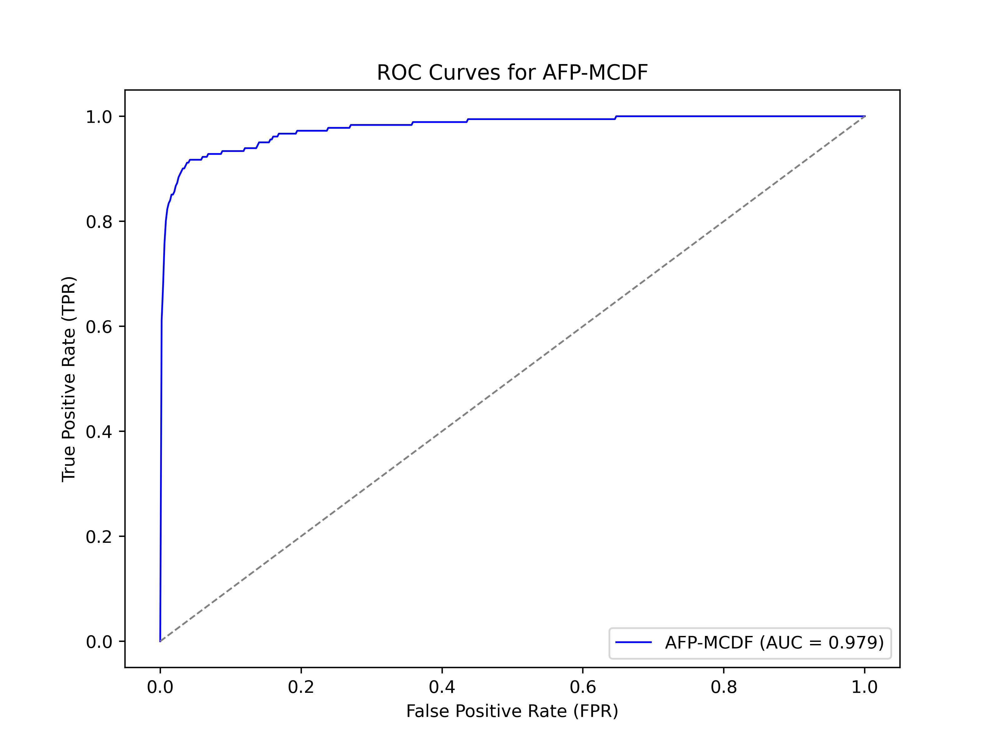

# AFP-MCDF

Source code and datasets for **AFP-MCDF: Multi and cross-dimensional feature fusion methods for antifreeze protein prediction**.

## Paper

- Title: AFP-MCDF: Multi and cross-dimensional feature fusion methods for antifreeze protein prediction
- Authors: Jinfeng Li, Fan Zhang, Zhenguo Wen, Chun Fang
- Journal: Analytical Biochemistry, 704, 115881, 2025
- DOI: https://doi.org/10.1016/j.ab.2025.115881
- ScienceDirect: https://www.sciencedirect.com/science/article/abs/pii/S0003269725001198
- PubMed: https://pubmed.ncbi.nlm.nih.gov/40348048/

## Overview

AFP-MCDF predicts antifreeze proteins from protein sequences by combining ProtBERT and ESM-based representations with multi-dimensional and cross-dimensional feature fusion modules.



## Repository Contents

- `data/train_300.csv`: balanced training dataset with 300 positive and 300 negative samples.
- `data/val_300.csv`: independent validation dataset.
- `data/length_counts_combined.txt`: sequence-length distribution statistics generated from the datasets.
- `scripts/plan_one_5fold_our.py`: main 5-fold AFP-MCDF experiment script.
- `scripts/plan_one_5fold_esm.py`: ESM-based 5-fold experiment.
- `scripts/plan_one_5fold_protbert.py`: ProtBERT-based 5-fold experiment.
- `scripts/plan_one_5fold_*.py`: ablation and comparison experiments.
- `scripts/plot.py`: plotting/evaluation script for saved model outputs.
- `assets/roc_curves.png`: ROC curve exported from the original experiment.
- `outputs/`: default location for generated model checkpoints and figures.

## Installation

Create an environment with Python 3.8 or newer, then install the dependencies:

```bash
pip install -r requirements.txt
```

The scripts expect local pretrained model directories named `ESM/` and `protbert/` at the repository root, or equivalent Hugging Face model paths configured in the scripts.

## Usage

Run commands from the repository root. For the main 5-fold experiment:

```bash
python scripts/plan_one_5fold_our.py
```

For single-model comparison experiments:

```bash
python scripts/plan_one_5fold_esm.py
python scripts/plan_one_5fold_protbert.py
```

Generated checkpoints and plots are written to `outputs/`.

## Notes

Large pretrained language-model weights and generated checkpoint files are not committed to this repository.
